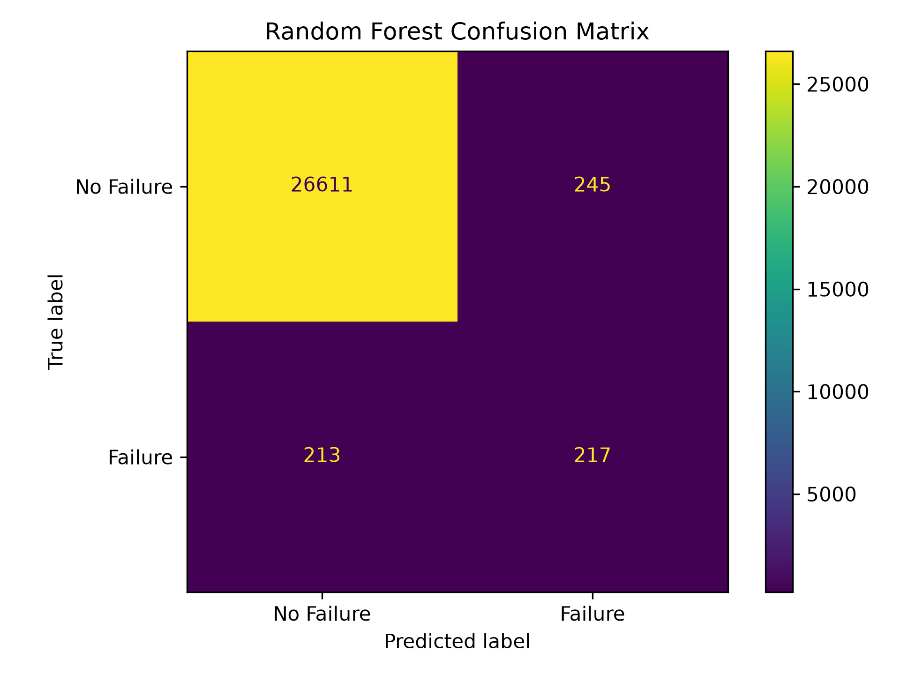
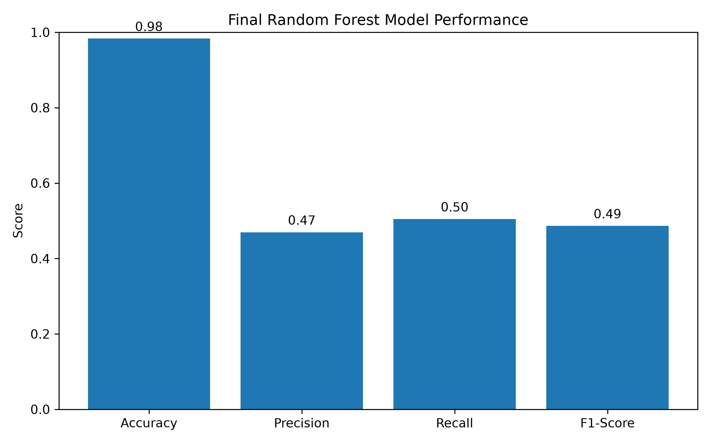

# Machine Failure Prediction

A Machine Learning project that predicts machine failure using operating conditions such as temperature, rotational speed, torque, and tool wear.

## 🚀 Live Demo

(https://tatamachinefailureprediction-gwyl9ugb2yx42jgf54zqun.streamlit.app/)

The application is built using Streamlit and can currently be run locally.

## 📁 Project Structure

```text
TATA_MACHINE_FAILURE_PREDICTION/
│
├── data/
│   ├── train.csv
│   └── test.csv
│
├── models/
│   ├── machine_failure_model.pkl
│   ├── scaler.pkl
│   ├── features.pkl
│   ├── threshold.pkl
│   ├── confusion_matrix.png
│   ├── model_performance.png
│   └── evaluation_metrics.csv
│
├── src/
│   ├── data_preprocessing.py
│   ├── feature_engineering.py
│   ├── train_model.py
│   ├── hyperparameter_tuning.py
│   ├── threshold_tuning.py
│   ├── feature_importance.py
│   ├── model_evaluation.py
│   └── predict.py
│
├── notebooks/
│   └── machine_failure_analysis.ipynb
│
├── app.py
├── requirements.txt
├── README.md
└── .gitignore
```

## 📸 Screenshots






## 🎯 Objective

The goal is to predict potential machine failures early and support preventive maintenance.

### Dataset

- Training Data: 136,429 rows × 14 columns
- Testing Data: 90,954 rows × 13 columns
- Target: `Machine failure`
- Highly imbalanced classification problem

## 🔧 Data Preprocessing

- Removed `id` and `Product ID`
- Encoded Type: `L → 0`, `M → 1`, `H → 2`
- Checked missing values
- Used stratified 80/20 train-validation split
- Applied feature scaling

### Feature Engineering

Created three additional features:

- **Temp Difference** = Process Temperature − Air Temperature
- **Power** = Torque × Rotational Speed
- **Wear per Speed** = Tool Wear / Rotational Speed

### Leakage Prevention

Removed:

`TWF`, `HDF`, `PWF`, `OSF`, `RNF`

These columns directly represent failure modes and could cause data leakage.

## 🤖 Machine Learning Models

The following models were evaluated:

- Logistic Regression
- Random Forest
- Gradient Boosting

GridSearchCV was used for hyperparameter tuning with F1-score as the main metric.

## 🏆 Final Model

**Random Forest Classifier**

Best parameters:

```text
n_estimators = 200
max_depth = None
min_samples_split = 5
class_weight = balanced
```

### Performance

| Metric | Score |
|---|---:|
| Accuracy | **98.32%** |
| Precision | **46.97%** |
| Recall | **50.47%** |
| F1-Score | **48.65%** |

### Confusion Matrix

```text
[[26611   245]
 [  213   217]]
```

## 🎚️ Threshold Tuning

Different classification thresholds were tested.

The **0.50 threshold** achieved the highest F1-score among the tested thresholds and is used in the application.

## ⭐ Feature Importance

Top features:

1. Rotational Speed
2. Torque
3. Power
4. Tool Wear
5. Wear per Speed

## 🌐 Streamlit Application

The application allows users to enter:

- Machine Type
- Air Temperature
- Process Temperature
- Rotational Speed
- Torque
- Tool Wear

It provides:

- Machine Failure Prediction
- Failure Probability

Run locally:

```bash
streamlit run app.py
```

## 💾 Saved Model Files

```text
machine_failure_model.pkl
scaler.pkl
features.pkl
threshold.pkl
```

## 🛠️ Technologies

- Python
- Pandas
- NumPy
- Scikit-learn
- Matplotlib
- Seaborn
- SciPy
- Joblib
- Streamlit

## 💼 Business Impact

The system can support predictive maintenance by providing early warnings of potential machine failures, helping reduce:

- Unexpected downtime
- Maintenance costs
- Equipment damage
- Production losses

## 🔮 Future Improvements

- Improve failure detection
- Try advanced ML models
- SHAP-based explainability
- Real-time sensor integration
- Cloud deployment
- Automated alerts
- Model monitoring

## 👨‍💻 Author

**Dravyesh Upadhyay**
